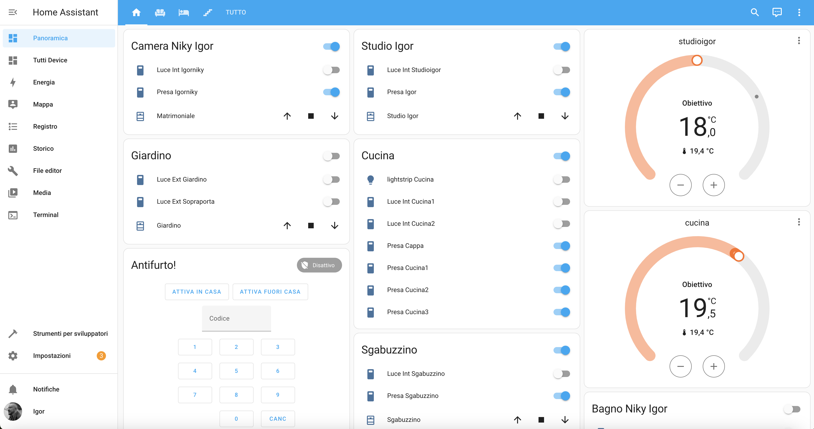
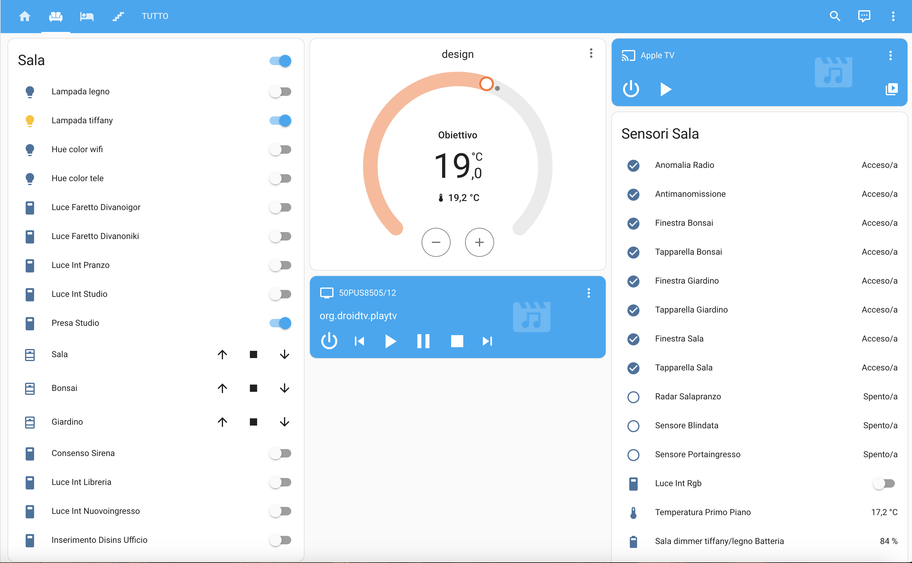
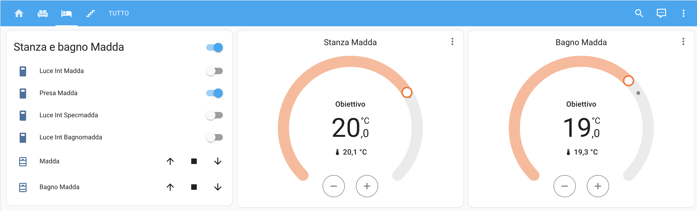
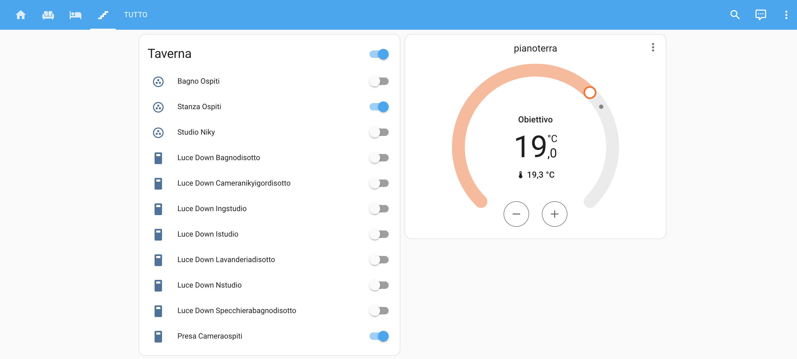
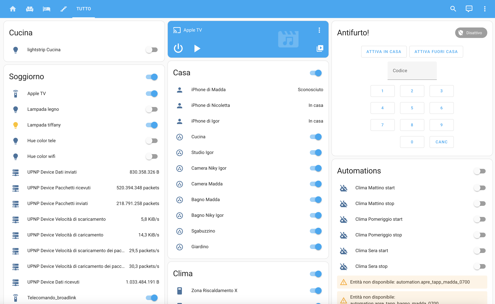

# Homeassistant Template Example By Igor

Home assistant Configuration (YAMLs)

This is my Home Assistant Configuration created on a Blue! Hardware.

- General view all rooms except Living room

- Living Room 
.   

- Madda's room

- Basement and all

